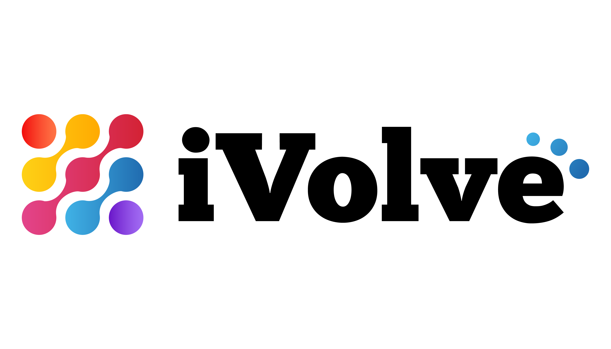

<p align="center">
  
  &nbsp;&nbsp;&nbsp;&nbsp;
  
</p>

<h1 align="center" style="font-family: 'Poppins', sans-serif; color: #e0e0e0; font-size: 2.8rem;">
   DevOps Graduation Project
</h1>

<h3 align="center" style="font-family: 'Poppins', sans-serif; color: #b0bec5;">
  In Collaboration with iVolve Technologies
</h3>

<p align="center" style="max-width: 700px; font-size: 1.1rem; color: #cfd8dc;">
  This project represents the culmination of the DevOps training at the National Telecommunication Institute (NTI),
  in partnership with iVolve Technologies. 
</p>

---

## 🐳 Containerization with Docker & Docker Compose

This project is containerized using **Docker** and **Docker Compose** to streamline development, deployment, and environment consistency.

### 📦 Project Structure

```
iVolveGraduationProject/
├── app/
│   ├── app.py
│   ├── requirements.txt
│   ├── static/
│   └── templates/
├── Dockerfile
├── docker-compose.yml
└── README.md
```

---

### 🏗️ Dockerfile (Multi-Stage)

The Dockerfile uses **multi-stage builds** to keep the image lightweight and secure:

```Dockerfile
# Stage 1: Install dependencies
FROM python:3.11-slim AS builder
WORKDIR /app
COPY app/requirements.txt .
RUN pip install --upgrade pip && pip install --user -r requirements.txt

# Stage 2: Runtime container
FROM python:3.11-slim
WORKDIR /app
COPY app/ .
COPY --from=builder /root/.local /root/.local
ENV PATH=/root/.local/bin:$PATH
EXPOSE 5000
CMD ["python", "app.py"]
```

---

### 🧩 docker-compose.yml

This Compose file builds the image, exposes port 5000, and supports local development with mounted volumes.

```yaml
version: '3.8'

services:
  flask-app:
    build:
      context: .
      dockerfile: Dockerfile
    image: mnagy156/flask-app:latest
    ports:
      - "5000:5000"
    volumes:
      - ./app:/app
    environment:
      - FLASK_ENV=development
      - FLASK_APP=app.py
    command: python app.py
```

---

### 🚀 Run the App

1. **Build and start the app**

```bash
docker-compose up --build
```

2. **Access it in your browser:**

```
http://localhost:5000
```

---

### ☁️ Push to Docker Hub

1. **Login to Docker Hub:**

```bash
docker login
```

2. **Build and push the image:**

```bash
docker-compose build
docker push mnagy156/flask-app:latest
```

---

### ✅ Notes

- Make sure `app.py` has this line for Docker networking to work:
  ```python
  app.run(host='0.0.0.0', port=5000, debug=True)
  ```

- You can remove the volume mount in production for performance and security.


---
